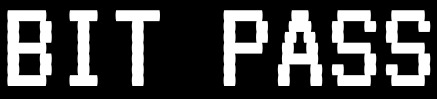

## Project Overview

**bitpass** is a powerful password generator and analysis tool that helps users
create strong and secure passwords for their online accounts. With its minimalistic
interface and advanced features, **bitpass** provides users with the ability to easily
generate and analyze passwords to ensure that they are strong, unique, and secure.

The program allows users to specify the length and complexity of their desired password,
and it generates passwords using a variety of characters, including letters, numbers, and
symbols. **bitpass** also includes a password analysis tool that evaluates the strength of
passwords based on various metrics, such as length, character diversity, and the presence of
commonly used passwords.

## Guidelines

The requirements for CSE's (Communications Security Establishment) challenge were as follows:

> CSE is looking to for ways to help people make more secure passwords
> or better decisions about cybersecurity, such as a **Web app** to rate the
> security of a password, display how long it would likely take to crack
> the password, and allow the user to **autogenerate passwords** of multiple
> different formats. Winners would be chosen based on ease of use,
> quality of suggestions, and innovative approaches to helping people
> make good decisions about their cybersecurity. Bonus points for making
> an app that can be run **locally without internet access** as well as an
> internet website.

## Technologies Used

### **bitpass** was developed using **Electron** and **React**.

Electron was used to build the user interface and create a seamless experience for users on both
Windows and Mac operating systems. We chose Electron for its ability to be used as an offline web application or
internet website, a key piece of criteria for the challenge.

React was used to create dynamic and interactive elements within the app, making it easier for users to
generate and analyze their passwords. We chose React because one of our group members had experience using
it to build user interfaces.

## What I learned

### Electron:

- **Cross-platform development:** _This provided an opportunity to learn about the different platforms
  and how to build apps that work seamlessly across them_
- **Web Technologies:** _Worked Electron into my existing experience with other web technologies, such as
  HTML, CSS, and JavaScript_

### React:

- **Managing state:** _Managed and how to manage state variables to build dynamic websites_
- **UI/UX:** _Learned how to build interactive user interfaces using React_
- **JSX:** _Learned JSX, a syntactical extension to JavaScript, to build React components_

## Key Features

### Password Generation:

Users can generate passwords of varying lengths and complexity. The program uses a variety of characters, including
letters, numbers, and symbols, to ensure that the generated passwords are strong and secure.
### Password Analysis:
Users can type in their desired password and the program will analyze it based on various metrics, 
such as length and included character sets. The program will then provide the user with a score based 
on the strength of the password. This process is responsive as the user changes their password, allowing 
the user to learn about the strengths, weaknesses, and improvements they can make to their password in real time.
## Screenshots or Demo Video

### bitpass - Simple password

### bitpass - Complex password

### bitpass - Simple user password analysis

### bitpass - Complex user password analysis

## Code Samples

## Contributions

## Future Goals

## References

## Collaborators

## Contact Information

